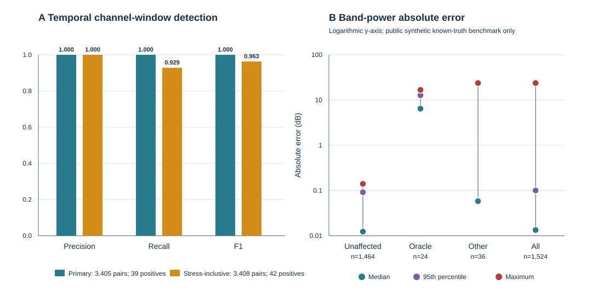

# Manuscript draft

> **Controlled draft — not for submission or public release.** The software and
> public synthetic results described below are complete. The real HBN path is
> limited to verified inventory, quality-control prompts and a controlled human
> review worksheet. Real channel, interval and ICA-component decisions, the
> corresponding preprocessing run and any participant-level scientific result
> are not yet available.

## Provenance-bound human review and deterministic preprocessing for dense-array EEG

### Abstract

Dense-array EEG preprocessing combines numerical operations with scientific
decisions about channels, time intervals and independent components. Existing
workflows often provide extensive automation, interactive review or processing
logs, but a log alone does not establish that a downstream run consumed the
same source bytes, review prompts and completed human decisions that were
actually inspected. We developed a Python workflow that separates screening
from decision-making and binds each human decision package to exact input,
software, runtime, quality-control and ICA-solution identities. Downstream
stages fail closed when those identities drift and publish only recursively
verified, exact-set output packages. The architecture was exercised across a
recovered 129-channel BrainVision stop-signal workflow and public synthetic
known-truth benchmarks. Transfer to a second public 129-channel BIDS/EEGLAB
dataset was evaluated through verified inventory and quality-control prompts;
real-data decisions and preprocessing remain incomplete.
Across three reserved synthetic QC seeds, primary temporal detection achieved
precision, recall and F1 of 1.00. The all-temporal stress-inclusive recall and
F1 were 0.929 and 0.963. A fixed reviewed synthetic ICA fixture reduced the
maximum absolute EEG-EOG correlation from 0.295 to 0.028 and EEG-ECG
correlation from 0.176 to 0.049 while retaining bounded signal-preservation
diagnostics. A separate synthetic BIDS/EEGLAB integration fixture reproduced
reviewed ICA, interpolation, epoch rejection and source-event lineage byte for
byte under a pinned runtime. These results validate workflow execution, identity closure and
the declared synthetic tests; they do not prove that participant EEG is clean,
that artifact prompts are scientifically correct or that the workflow
generalizes across laboratories.

**Keywords:** dense-array EEG; reproducibility; provenance; quality control;
BIDS; EEGLAB; MNE-Python; human review

## Introduction

EEG preprocessing is not a single numerical transformation. It is a sequence of
measurement checks, signal operations and scientific judgements. A channel can
be unusual without being unusable, a transient can matter for ICA but not for a
later epoch, and an ICA component can resemble an artifact without justifying
automatic removal. These distinctions become especially important in
dense-array recordings, where many channels and long continuous files make
manual inspection expensive while automatic thresholds can hide local failure
modes.

Several established systems address important parts of this problem. PREP [1],
HAPPE and HAPPE+ER [2,3], Automagic [4], MNE-BIDS-Pipeline [11] and CLEAN-EEG [9]
provide standardized or automated processing, quality metrics and reporting.
EEG-IP-L/Lossless [6] and its current PyLossless implementation [10] emphasize
non-destructive annotations, interactive review and analysis-specific rejection
policies. EEGPrep [8] targets stage-by-stage numerical agreement with the
EEGLAB workflow. General systems such as DataLad [12] and the FAIRly big framework
[7] provide broader computational provenance and re-execution, while EEG-BIDS
[5] standardizes the source-data organization. The present work does not
replace these systems and does not introduce a new artifact classifier.

The narrower problem considered here is the boundary between review and
processing. A screening algorithm can create useful prompts, but a prompt is
not a scientific decision. A decision table can be complete, but it is not
safe to apply if the source recording, prompt package, software, runtime or ICA
solution has changed. A processing directory can contain plausible outputs,
but it is not a closed result if stale, undeclared or modified files can be
mixed into it.

We therefore asked whether a dense-array EEG workflow could make event
reconstruction, quality review, preprocessing decisions and output lineage
explicit enough to be checked and repeated without converting heuristics into
automatic scientific decisions. The contribution is a review-to-processing
contract: automated screening produces evidence prompts only; humans supply
complete channel, interval and component decisions; each package is bound to
the exact context it authorizes; and every downstream stage fails closed when
that context no longer matches.

## Methods

### Study design and evidence partitions

Five evidence partitions were kept separate throughout development. First, a
controlled private rerun tested the recovered legacy BrainVision workflow on 10
recordings. Second, a public synthetic known-truth benchmark evaluated temporal
QC prompts and signal preservation. Third, a fixed public synthetic ICA fixture
tested reviewed component application and preservation accounting. Fourth, a
public HBN BIDS/EEGLAB recording tested source inventory and prompt generation
without authorizing real cleaning. Fifth, a synthetic BIDS/EEGLAB fixture tested
the complete review-finalization, ICA, interpolation and epoch-rejection
software path. Metrics from these partitions were not pooled.

### Legacy BrainVision workflow

The legacy path reads a complete BrainVision triplet and validates its identity
before processing. An explicit marker state machine reconstructs go and stop
trials. A successful stop is inferred only when the required marker sequence is
closed by a following trial boundary; this is an operational reconstruction,
not independent behavioral ground truth. Processing proceeds as continuous
filtering, reviewed bad-channel marking, initial average reference, reviewed
ICA when enabled, interpolation, final average reference and epoching. FIF and
EEGLAB exports are supported by the software and synthetic tests. EEGLAB export
was disabled in the controlled 10-recording rerun.

### Synthetic QC benchmark

Synthetic 129-channel recordings contain complete go and stop marker sequences
and controlled corruption families: flat channels, intermittent amplitude
artifacts, line noise, ocular and cardiac artifacts, and a short electrode-pop
stress condition. Temporal prompts are evaluated as channel-window pairs. The
primary metric excludes the deliberately difficult stress row; the
stress-inclusive metric retains it. Line-noise concentration is computed from
the raw power spectral density rather than after the 1–40 Hz analysis filter.
Signal preservation compares the processed signal with a clean reference that
undergoes the same non-artifact transformations. Unaffected,
oracle-interpolated and other corrupted channel-band values are reported
separately.

The three reserved evaluation seeds differ from development seeds but retain
the same declared generative family. They therefore constitute a seed-level
holdout, not external validation or a test of unseen artifact conditions.

### Reviewed ICA validation

ICA uses extended Infomax and records the MNE small-angle stopping rule rather
than claiming mathematical convergence. Review material includes component
topographies, time courses, spectra, variance accounting and correlations with
available EOG and ECG channels. These values are review cues only. Every
component requires an explicit human decision, and no component is removed
automatically. A decision package is accepted only when it matches the exact
fitted ICA solution and preprocessing context.

Signal-preservation checks report the full denominator for channel-band values,
the median, upper tail and maximum absolute change, auxiliary-channel
correlations, and C3/C4 task-peak amplitude and latency differences. The fixed
fixture is an integration test and is not an estimate of real-participant
artifact removal.

### Public BIDS/EEGLAB adapter

The transfer path uses OpenNeuro dataset ds005508 snapshot 1.0.1, a public
129-channel BIDS/EEGLAB recording from the HBN contrast-change task. The adapter
derives one recording identity from its BIDS entities, discovers inheritance-
applicable sidecars, binds split `.set` and `.fdt` payloads, validates supported
units and event timing, reconstructs the declared flat Cz online reference and
checks the supplied standard-template sensor layout. The geometry check
supports interpolation under the declared template-layout assumption; it does
not establish an individual digitized head fit.

Full-recording QC screens nominal non-overlapping 20-second windows, including
the final partial window. Relative amplitude and flatness scores use a 1–40 Hz
fourth-order zero-phase Butterworth view; raw-PSD 60 Hz concentration is ranked
separately. The union of temporal and line-noise prompts forms the channel
review ledger. Every temporal prompt forms a segment review row. A prompt is a
request for inspection, not a bad-channel or artifact label.

### Human review contract

The controlled worksheet presents the exact QC and review-package identities,
one row for every prompted channel and interval, and links to evidence verified
when the worksheet is built. Separate session identifiers and controlled
browser profiles prevent two reviewers from sharing mutable browser state.
Browser state remains unverified working state. Only exported TSV files that
pass the finalizer become provenance-bound decisions.

Channel rows require a `keep` or `interpolate` decision, reviewer, date and
evidence reference. Segment rows require `keep` or `exclude`; exclusions also
require a refined onset, duration and scope (`ica`, `epochs` or `both`). A
refined prompted interval must overlap its prompt. Manual additions use an
explicit `manual_addition` reason and written rationale. Segment additions use
distinct `manual-*` identifiers. Finalization fails when any prompt is missing,
pending, changed or incompletely documented.

Independent-review agreement, if collected, is computed only over comparable
prompt rows and is kept separate from adjudicated decisions used for
preprocessing. Manual additions and differences in refined boundaries are
reported explicitly rather than forced into the prompt-level agreement score.

### Filtering, ICA, interpolation and epochs

New reviewed exclusion intervals are expanded by half the support of the same
zero-phase FIR filter used downstream. This contains the finite filter response
of samples inside the reviewed interval; it is not a claim that all surrounding
signal is artifact-free. Source `BAD_*` annotations are used as supplied,
without independent validation of their boundaries.

ICA is fit before channel interpolation. Reviewed component exclusions are
then applied, reviewed bad channels are interpolated only when the geometry gate
passes, and the average reference is restored. Epochs overlapping reviewed or
guard annotations are rejected. The minimum retained-event requirement is
enforced after rejection. Each lineage row preserves the exact source
`events.tsv` row, onset, sample, condition-local index and drop reason.

### Provenance and atomic publication

Small mutable controls, decision tables and selected solution files are read
once, hashed and parsed from the captured bytes. Large EEG payloads are consumed
in place under initial and final identity checks. Each package records an
executable source manifest, configuration and dependency hashes, Python,
platform and package versions, upstream package identities and recursive output
hashes.

Output paths must be new and outside protected source or evidence trees.
Lexical and resolved path checks reject unsafe traversal and symlink mixing.
Processing and review packages are assembled in a sibling temporary location,
verified against an exact recursive file set, and published atomically.
Upstream identities and the published processing or review package are checked
again after publication; failure removes the new output. The manuscript-only
asset bundle is exact-set verified immediately before an atomic no-replace
publication. These guarantees establish deterministic and provenance-bound
execution under the pinned runtime, not cross-platform numerical equivalence.

### Statistical reporting

Detection metrics are precision, recall and F1 over declared channel-window
pairs with explicit positive and total denominators. Signal-preservation
summaries retain median, 95th percentile and maximum absolute differences and
separate unaffected from deliberately corrupted subsets. The controlled legacy
rerun is summarized only by aggregate execution and provenance counts. For HBN,
prompt-generation counts may be reported as bounded software behavior, but no
cleaning, decision, signal-change or task-effect result is included before
completed human decisions and the corresponding verified rerun.

## Results

### Workflow implementation

The implementation produces separate exact-set packages for inventory, QC
prompts, finalized channel and interval decisions, ICA review, finalized
component decisions and preprocessing outputs. Synthetic integration tests
exercise one component exclusion, one post-ICA channel interpolation and one
reviewed epoch rejection while retaining source BIDS-row lineage. Repeated runs
under the pinned environment produced byte-identical packages.

### Controlled legacy execution

All 10 controlled BrainVision recordings completed, covering 121.7 recording
minutes, 129 channels and a sampling frequency of 1000 Hz. Participant outputs
and the dataset aggregate passed provenance verification. This supports
execution and accounting claims only. It does not provide independent ground
truth for reconstructed events, channel decisions or artifact removal.

### Synthetic QC benchmark

Across three reserved seeds, primary temporal detection had precision, recall
and F1 of 1.00. Each recording contained 13 positive pairs among 1,135 primary
channel-window pairs per recording. Across all three recordings, this was 39
positive pairs among 3,405 primary pairs. One additional 100-microvolt,
0.5-second electrode-pop stress positive was diluted within its 20-second
window and missed in each seed. The all-temporal result therefore covered 42
positives among 3,408 pairs, with recall 0.929 and F1 0.963; equivalently, 1,136
all-temporal pairs per recording.

Signal-preservation errors differed strongly across the prespecified subsets:

| Channel-band subset | Values | Median absolute error (dB) | 95th percentile (dB) | Maximum (dB) |
| --- | ---: | ---: | ---: | ---: |
| Unaffected | 1,464 | 0.012 | 0.092 | 0.141 |
| Oracle-interpolated | 24 | 6.450 | 12.751 | 16.798 |
| Other corrupted | 36 | 0.058 | 23.293 | 23.774 |
| All values | 1,524 | 0.013 | 0.100 | 23.774 |

Across all 1,524 channel-band values, the unaffected subset contained 1,464
values with median, 95th-percentile and maximum absolute errors of 0.012, 0.092
and 0.141 dB. The oracle-interpolated subset contained 24 values with errors of
6.450, 12.751 and 16.798 dB. The other corrupted subset contained 36 values
with errors of 0.058, 23.293 and 23.774 dB. The overall median,
95th-percentile and maximum errors were 0.013, 0.100 and 23.774 dB. Thus, the
median absolute power error 0.012 dB and 95th-percentile error 0.092 dB in
unaffected values did not characterize the two corrupted subsets.

**Figure 2. Public synthetic QC validation.** Panel A pools three reserved
synthetic seeds. One pair is one channel in one nominal 20-second window, and a
positive is a known injected affected pair. Primary metrics cover 39 positives
among 3,405 pairs. Stress-inclusive metrics add one missed short electrode-pop
positive per seed, giving 42 positives among 3,408 pairs. Panel B shows
channel-band values on a logarithmic axis. The all-values summary is a
descriptive mixture dominated by the 1,464 unaffected values among 1,524 total
values, not a standalone performance target. The plotted values and exact
denominators are retained in the tracked
[aggregate CSV](paper_assets/tables/synthetic_qc_validation.csv).

### Synthetic ICA validation

On the fixed seed-4401 fixture, the MNE small-angle stopping rule was met after
530 iterations. Two reviewed components were excluded. Maximum absolute
EEG-EOG correlation changed from 0.295 to 0.028 and maximum absolute EEG-ECG
correlation changed from 0.176 to 0.049.

Across 508 channel-band values, the median, 95th-percentile and maximum absolute
changes were 0.082, 0.645 and 0.994 dB. The largest C3/C4 peak-amplitude change
was 0.230 microvolts and the largest latency change was 0 ms. These values
describe one known synthetic fixture and do not establish participant-level
cleaning effectiveness.

The aggregate values underlying this section are available in a reproducible
[ICA validation CSV](paper_assets/tables/synthetic_ica_validation.csv).

### Public BIDS/EEGLAB transfer path

The synthetic BIDS/EEGLAB fixture reproduced complete ICA-decision and
preprocessing packages byte for byte under the pinned runtime. The real HBN
recording passed the bounded source inventory and produced a controlled QC and
review package. The current human-review worksheet contains 31 channel prompts
and 49 segment prompts. All remain pending in the immutable starting templates;
no real channel, interval, component or cleaning result is reported.

## Discussion

The main result is not a higher artifact-classification score. It is an
executable separation between screening, human authorization and processing.
The workflow prevents a QC flag from silently becoming a channel interpolation,
a high ICA correlation from silently becoming a component exclusion, or an old
decision table from authorizing a run on changed inputs. It also makes negative
states explicit: a package can be valid but incomplete, controlled but not
publishable, or deterministic without being scientifically validated.

The synthetic QC result shows why a single overall score is insufficient. The
primary detector performed perfectly under its declared corruption family, yet
the short 100-microvolt stress artifact was diluted within a 20-second window
and missed in every reserved seed. Likewise, the ICA fixture shows substantial
reduction in auxiliary-channel correlations but cannot establish that the same
components or thresholds are appropriate for participant EEG. These failures
and limits are part of the validation result rather than exceptions to hide.

The closest methodological comparison is PyLossless, which already combines
non-destructive sensor, time and component flags with interactive review and
analysis-specific policies. The contribution here is narrower: no automatic
cleaning or exclusion decisions, complete human-decision ledgers, immutable
binding to source, prompt, software, runtime and solution identities, and
fail-closed exact-set publication at every downstream boundary. This is a
domain-specific decision contract, not a replacement for BIDS, DataLad or a
general workflow engine.

The transfer from a recovered BrainVision stop-signal workflow to a public
BIDS/EEGLAB contrast-change recording demonstrates format and task separation
at the software level. Scientific transfer remains unfinished until the real
review, component decisions and controlled rerun are complete. The current HBN
evidence therefore supports adapter and prompt-generation behavior only.

## Limitations

The reserved synthetic seeds share the same generative family and are not
external validation. The ICA checks use one fixed synthetic fixture. The legacy
rerun has no public decision-level reproduction and no independent ground truth.
The HBN geometry gate validates a declared standard-template layout rather than
individual digitized coordinates. The current manual review has one primary
reviewer; agreement cannot be claimed unless a genuinely independent session is
completed. Source `BAD_*` boundaries are not independently validated. No
participant-level ERP, time-frequency, stop-signal, diagnostic or clinical
claim is supported.

## Data, code and privacy boundary

Public synthetic fixtures, machine-readable aggregate summaries and the source
code are intended to provide decision-level reproducibility for the synthetic
paths. The controlled legacy recordings, participant decisions, detailed QC
reports and participant-level derived outputs remain private. Public text and
figures must not contain participant mappings, decision rows, exclusion
intervals or participant-linked hashes. The HBN source data remain governed by
their OpenNeuro dataset terms; controlled derived packages are not authorized
for publication by this draft.

## Conclusion

The workflow makes the transition from EEG review to processing explicit and
machine-checkable without turning screening heuristics into scientific
decisions. Current evidence supports deterministic execution and provenance
closure for the public synthetic workflows, aggregate execution of the
controlled legacy path, and fail-closed inventory and prompt generation for the
real HBN recording. Evidence for real HBN decisions, preprocessing and signal
effects remains to be established.

## References

1. Bigdely-Shamlo N, Mullen T, Kothe C, Su KM, Robbins KA. The PREP pipeline:
   standardized preprocessing for large-scale EEG analysis. *Frontiers in
   Neuroinformatics*. 2015;9:16. https://doi.org/10.3389/fninf.2015.00016
2. Gabard-Durnam LJ, Mendez Leal AS, Wilkinson CL, Levin AR. The Harvard
   Automated Processing Pipeline for Electroencephalography (HAPPE).
   *Frontiers in Neuroscience*. 2018;12:97.
   https://doi.org/10.3389/fnins.2018.00097
3. Monachino AD, Lopez KL, Pierce LJ, Gabard-Durnam LJ. The HAPPE plus
   Event-Related (HAPPE+ER) software. *Developmental Cognitive Neuroscience*.
   2022;57:101140. https://doi.org/10.1016/j.dcn.2022.101140
4. Pedroni A, Bahreini A, Langer N. Automagic: Standardized preprocessing of
   big EEG data. *NeuroImage*. 2019;200:460-473.
   https://doi.org/10.1016/j.neuroimage.2019.06.046
5. Pernet CR, Appelhoff S, Gorgolewski KJ, et al. EEG-BIDS, an extension to the
   brain imaging data structure for electroencephalography. *Scientific Data*.
   2019;6:103. https://doi.org/10.1038/s41597-019-0104-8
6. Desjardins JA, van Noordt S, Huberty S, Segalowitz SJ, Elsabbagh M. EEG
   Integrated Platform Lossless preprocessing pipeline. *Journal of
   Neuroscience Methods*. 2021;347:108961.
   https://doi.org/10.1016/j.jneumeth.2020.108961
7. Halchenko YO, Meyer K, Poldrack B, et al. FAIRly big: A framework for
   computationally reproducible processing of large-scale data. *Scientific
   Data*. 2022;9:80. https://doi.org/10.1038/s41597-022-01163-2
8. Delorme A, Ranganath S, Kothe C, Jaiswal A, Makeig S, Aristimunha B.
   EEGPrep: a validated Python implementation of the EEGLAB preprocessing
   pipeline. *arXiv*. 2026. https://doi.org/10.48550/arXiv.2607.16647
9. Böttcher A, Wendiggensen P, Mückschel M, et al. Standardizing EEG
   preprocessing for cross-site integration: the CLEAN pipeline. *NeuroImage*.
   2026;328:121812. https://doi.org/10.1016/j.neuroimage.2026.121812
10. Huberty S, Desjardins J, Collins T, Elsabbagh M, O'Reilly C. PyLossless: A
    non-destructive EEG processing pipeline. *Behavior Research Methods*.
    2026;58:220. https://doi.org/10.3758/s13428-026-02997-z
11. Höchenberger R, Larson E, Gramfort A, et al. MNE-BIDS-Pipeline: v1.10.0.
    *Zenodo*. 2026. https://doi.org/10.5281/zenodo.19440738
12. Halchenko YO, Meyer K, Poldrack B, et al. DataLad: distributed system for
    joint management of code, data, and their relationship. *Journal of Open
    Source Software*. 2021;6(63):3262.
    https://doi.org/10.21105/joss.03262

The comparison boundaries and reference notes are maintained in
[`related_work.md`](related_work.md). Reference metadata must be exported and
checked against the primary sources before journal submission.
